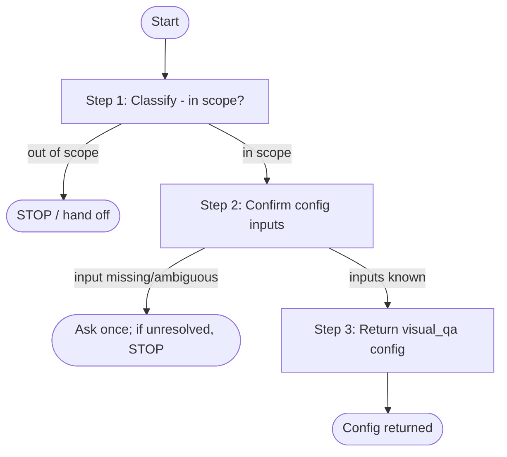

# Visual QA stage

Single-stage reference for the `visual_qa` stage that answers a question bank
over active media (VLM, or VLM+LLM) and emits QA item sidecars plus DAFT task QA
(`mcq`/`bcq`, with optional reasoning traces).

## When to use / not use

- Use: choosing a generation mode, wiring the question bank and endpoints,
  enabling reasoning traces, or fixing truncated/empty answers on reasoning models.
- Do not use: to run a full pipeline end to end, author a whole cookbook, or
  write the question bank itself.

## Instructions

This skill returns visual_qa configuration or debugging guidance; it does not run
the pipeline. Provide the config immediately - do not gate it behind execution.
The steps are a short linear sequence (1 -> 3); the failure note after them
applies whenever a step or a prior run fails. The three numbered steps are the
only flow nodes: the *Config*, *Examples*, *Gotchas*, and *Guardrails* sections
are reference content and author-time constraints, not flow steps or loops. In
particular, guardrails (no secrets/home paths) are declarative warnings applied
while writing the config in Step 3, not a validation gate that loops back to
revise it; the config is returned once.

Canonical flow (transcribe this graph; the generation-mode, reasoning-trace, and
sidecar choices are values set inside Step 3, not separate nodes, and there is no
validation back-edge):



A step/prior-run failure (unreachable endpoint, missing bank, truncated answers)
is a terminal report per *Failure / fallback handling* below - not a loop back to
earlier steps.

1. **Classify the task (in scope?).** Choosing a generation mode, wiring the
   question bank/endpoints, enabling reasoning traces, or debugging
   truncated/empty answers - all in scope. Running a full pipeline, authoring a
   whole cookbook, or writing the question bank itself are out of scope -> STOP
   and hand off.
2. **Confirm config inputs.** The `visual_qa` config needs a generation mode, a
   `question_bank_file` for every mode except `normalize-only`, and the endpoints
   that mode requires (VLM and/or LLM per mode - see *Config*). If any is missing
   or ambiguous, ask the user; do not guess.
3. **Return the config.** Produce the `visual_qa:` block and `stage_args.visual_qa`
   per *Config* and *Examples*. For reasoning/"thinking" models raise `max_tokens`
   (see *Gotchas*). To inspect the generated command, the operator runs a dry-run
   (`--container-dry-run`) - that execution belongs to the operator skill, not
   here.

**Failure / fallback handling.** On a missing/unreadable question bank, an
unreachable VLM/LLM endpoint, or truncated/empty answers, report the specific
cause and fix (e.g. raise `max_tokens` for reasoning models); do not fabricate
answers and do not retry blindly. Executing the stage (Docker via
`workflow-runner`, with approval) is the operator skill's job.

## Config

Cookbook block `visual_qa:` (essential fields):
- `enabled: true`
- `question_bank_file: <path>` (required for every mode except `normalize-only`)
- Endpoints depend on the generation mode: `window-direct-vlm` needs
  `endpoints.vlm` only; `window-vlm-llm` needs both `endpoints.vlm` and
  `endpoints.llm`; `metadata-llm` needs `endpoints.llm` only; `normalize-only`
  needs neither (it consumes existing QA sidecars).
- `max_tokens: ~4096` default, tuned for non-reasoning instruct models (Qwen).

Key `stage_args.visual_qa` flags:
- `--generation-mode normalize-only|window-direct-vlm|window-vlm-llm|metadata-llm`.
- `--input-source original|tracking`.
- `--single-window`.
- `--include-reasoning` — emits a per-answer `reasoning_trace` on every
  closed-choice item; the DAFT pivot copies it into the `reasoning` field of
  `task/mcq.json` and `task/bcq.json`.
- `--max-frames`, `--sampling-fps`, `--resolution`, `--temperature`.
- Sidecar keys: `--raw-windows-sidecar`, `--output-items-sidecar`,
  `--output-windows-sidecar`, `--state-artifacts-key`.

## Examples

VLM+LLM QA with reasoning traces on a reasoning model:

```yaml
visual_qa:
  enabled: true
  question_bank_file: question_bank.json
  max_tokens: 32768        # reasoning/thinking model; keep ~4096 for instruct
endpoints:
  vlm: { url: http://host.docker.internal:18002/v1, model: gcp/google/gemini-3-pro }
  llm: { url: http://host.docker.internal:18003/v1, model: gcp/google/gemini-3-pro }
stage_args:
  visual_qa: >-
    --generation-mode window-vlm-llm
    --input-source tracking
    --include-reasoning
    --max-frames 16 --sampling-fps 2 --resolution 448
```

`window-direct-vlm` (VLM only, no LLM endpoint):

```yaml
visual_qa:
  enabled: true
  question_bank_file: question_bank.json
endpoints:
  vlm: { url: http://host.docker.internal:18002/v1, model: <vlm-model> }
stage_args:
  visual_qa: --generation-mode window-direct-vlm --input-source tracking
```

`metadata-llm` (LLM only; answers from existing metadata sidecars, no VLM):

```yaml
visual_qa:
  enabled: true
  question_bank_file: question_bank.json
endpoints:
  llm: { url: http://host.docker.internal:18003/v1, model: <llm-model> }
stage_args:
  visual_qa: --generation-mode metadata-llm
```

This skill supplies only the `visual_qa` config above. Inspecting the generated
Docker command (dry-run) and running the pipeline are the operator skill's
responsibility; this skill does not invoke `workflow-runner`.

## Gotchas

- Writing the question bank is a separate prompt-authoring task; this stage only
  consumes the bank.
- `--include-reasoning` is what carries reasoning traces into closed-choice tasks.
- For reasoning/"thinking" models (e.g. `gcp/google/gemini-3-*`) raise
  `max_tokens` substantially (e.g. `32768`, under the model output ceiling) or
  answers truncate/empty (thinking-token tax); non-reasoning models keep the cap.
- `--state-artifacts-key` namespaces reruns.

## Guardrails

Follow [guardrails.md](guardrails.md). Question banks are repository paths, not
inlined contents; caches use `<model-cache>`.
