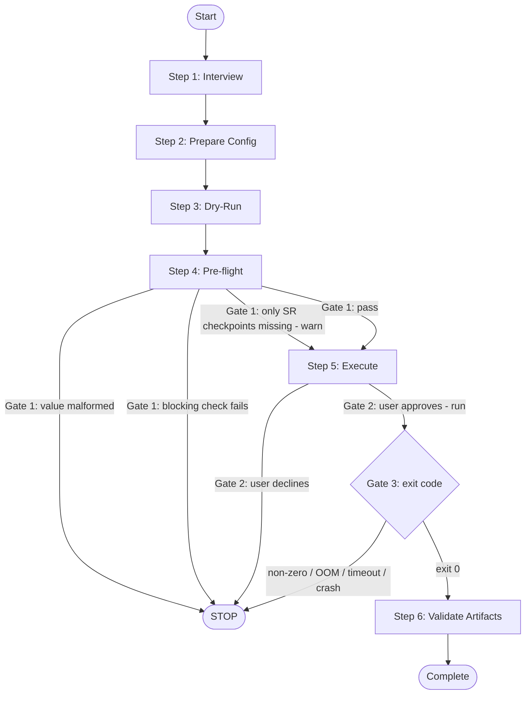

# PAIDF Video Data Augmentation Pipeline

Use this skill when the user wants to RUN the end-to-end Video Data
Augmentation pipeline (traffic-safety use case) on a clip or media directory
through the PAIDF `workflow-runner` container. The shipped cookbook is
`cookbooks/video_data_augmentation/configs/pipeline_video.yaml` (pipeline:
`video`). Build a complete run, then obtain explicit user approval before
executing any Docker command.

The pipeline runs five stages in fixed order:
`super_resolution` -> `detection_and_tracking` -> `captioning` -> `visual_qa` ->
`reasoning`.

## Workflow

Canonical flow (this diagram is authoritative - transcribe it; do not infer extra
nodes). The only nodes are the six numbered steps plus the `Start`, `STOP`, and
`Complete` terminals; the only stops are the three gates in Steps 4-5.



A Gate 3 `STOP` is terminal for the current run; a rerun is a new pass that
re-enters at Step 5 only after the user asks (see Step 5).

The flow is a strict linear spine: Step 1 -> 2 -> 3 -> 4 -> 5 -> 6. The six
numbered steps are the only nodes in this flow; the interview questions in Step 1
and the bullet lists in Steps 2-4 are that step's content (inputs gathered or
config values set), not separate flow nodes or branches. Steps 1-3 always run and
each hands directly to the next; any conditionals inside them (scope,
reasoning-model `max_tokens`, runner image) only set config values and never skip
a step, so they are not branches in the flow. The flow can stop at exactly three
gates: Step 4 (readiness - which blocks on either a malformed-input confirmation
or a failed check), Step 5 (approval), and the Step 5 execution result.
Each step below opens with a one-line signature stating whether it is mandatory,
when it runs, and what it produces. Combine steps into one turn when the user has
already supplied the required inputs.

### Step 1: Understand the Goal (Interview)

*Mandatory first step. Produces: the run inputs (media, endpoints,
reasoning-model flag, SAM3 path, GPUs, scope). Then go to Step 2.*

Ask in one message (skip anything already answered):

1. **Media**: input clip or media directory, and its rough resolution (drives
   super_resolution behavior).
2. **Endpoints**: served VLM and LLM base URLs and model names. Is the
   reasoning/visual_qa LLM a reasoning ("thinking") model, for example
   `gcp/google/gemini-3-*`?
3. **SAM3 weights**: host path to mount at `/models/sam3`.
4. **GPUs**: which GPU ids are free; SeedVR2 super_resolution is heavy and needs
   a dedicated GPU.
5. **Scope**: full pipeline, or a subset of stages.

### Step 2: Prepare the Run Config

*Mandatory; runs after Step 1. Produces: a completed `pipeline_video.yaml` for
this run. Then go to Step 3.*

- Set the run values in your local working copy of `pipeline_video.yaml` - do not
  stage or commit these edits: the media path (`data.0.inputs.media_path`), the
  SAM3 weights host mount (`container.mounts`, host side of `:/models/sam3:ro`),
  and the served VLM/LLM model names under `endpoints`.
- Keep the tracked/committed cookbook on placeholder paths and
  `NVIDIA_API_KEY` env names: never commit real media paths, host
  mounts, endpoints, or secrets. The working-copy edits above are for running this
  pipeline only; leave the tracked file unchanged in git.
- Set `stages` from scope (a value, not a branch): full pipeline keeps all five
  stages; a requested subset sets `stages` to that subset. Relative order is
  unchanged either way.
- Keep `super_resolution.resolver/variant`,
  `detection_and_tracking.classes/prompts`, and `stage_args` as shipped unless
  the user asks to change them.
- Set the reasoning-substage `max_tokens` from the model type (a value, not a
  branch): a reasoning/"thinking" LLM raises it; a non-reasoning instruct model
  keeps the defaults. See the reasoning `max_tokens` note in
  [run-reference.md](video-data-augmentation/run-reference.md).
- Read [run-reference.md](video-data-augmentation/run-reference.md) for the stage-by-stage
  config summary, mounts/endpoints/GPU needs, and expected artifacts.

### Step 3: Container Dry-Run

*Mandatory; runs after Step 2. Produces: the inspected runner-generated Docker
command (nothing is executed here). Then go to Step 4.*

Always dry-run first to inspect the runner-generated Docker command; use the
dry-run command in [run-reference.md](video-data-augmentation/run-reference.md).

Confirm the generated command includes the intended stages, the SAM3 mount, the
model-cache mount, GPU selection, endpoint values, and every intended
`stage_args` flag. Set the `--container-build-images` flag from image state (a
value, not a branch): add it when the runner image is missing or stale, omit it
when the image is already built. Either way, go to Step 4.

### Step 4: Pre-flight Checklist

*Mandatory; runs after Step 3. Produces: a pass/fail readiness report. Gate 1 -
this is where the flow can stop before execution.*

Validate substituted values first: confirm each value that goes into the checks
below (media path, SAM3 path, model-cache path, endpoint URLs, `out_dir`) is
well-formed and safely quoted. If any value looks malformed or contains
unexpected characters, STOP and confirm it with the user before running any
command. This malformed-input STOP is part of Gate 1 (readiness), not a separate
gate.

Then report pass/fail before asking for execution approval. Check only what the
enabled `stages` need: each item below is blocking only when a stage that
requires it is in `stages` (shown in parentheses). Skip - do not fail - checks
whose stages are not in this run (e.g. a `captioning`-only run does not need SAM3
weights or a dedicated SR GPU).

```text
[ ] Input media exists        →  ls <media_path>            (always blocking)
[ ] SAM3 weights present      →  ls <sam3_weights_host_path> (blocking iff detection_and_tracking enabled)
[ ] SR GPU free (dedicated)   →  nvidia-smi                 (blocking iff super_resolution enabled)
[ ] Model cache / checkpoints →  ls <model_cache_path>      (super_resolution: warn-only, see Gate 1)
[ ] VLM endpoint reachable    →  curl -s <vlm_url>/models   (blocking iff captioning, visual_qa, or reasoning enabled; no secrets in logs)
[ ] LLM endpoint reachable    →  curl -s <llm_url>/models   (blocking iff visual_qa or reasoning enabled; no secrets in logs)
```

Shell safety: always double-quote user-provided values (media path, SAM3 path,
model-cache path, endpoint URLs) when substituting them into these commands -
e.g. `ls "<media_path>"`, `curl -s "<vlm_url>/models"` - so spaces or shell
metacharacters cannot break or alter the command. Never place API keys or tokens
on the command line or in logged URLs; pass secrets only via the
`NVIDIA_API_KEY` env names.

Gate 1 (readiness) - trigger: substituted values have been validated and the
checklist has been run. Evaluate each item only for the enabled `stages`; an item
required solely by a stage that is not in this run is never a blocker. Outcomes:
- A substituted value looks malformed or contains unexpected characters -> STOP
  and confirm it with the user before running; do not proceed to Step 5.
- A blocking item for an enabled stage fails (missing input media; missing SAM3
  weights when `detection_and_tracking` is enabled; a VLM endpoint unreachable
  when `captioning`/`visual_qa`/`reasoning` is enabled; an LLM endpoint
  unreachable when `visual_qa`/`reasoning` is enabled; no free GPU when
  `super_resolution` is enabled) -> STOP and report the failure; do not proceed
  to Step 5.
- Only checkpoints are missing and `super_resolution` is enabled -> warn, then
  continue forward to Step 5 (do not re-run the checklist; stage init may fetch
  SeedVR2 weights on first run, so the first run can spend time downloading).
- All items required by the enabled stages pass -> go to Step 5.

### Step 5: Execute (Approval Required)

*Mandatory; runs after a passing Step 4. Produces: either an executed run or a
STOP. Holds Gate 2 (approval) and Gate 3 (execution result).*

After a passing pre-flight, present an execution summary (full command, GPU
count, expected long runtime for SR + reasoning, mounts, endpoints, output
directory). Use the execute command in
[run-reference.md](video-data-augmentation/run-reference.md).

Gate 2 (approval) - trigger: the summary has been presented. Outcomes:
- User declines -> STOP; run no Docker command.
- User approves that exact command -> run it (set a generous timeout;
  super_resolution (SeedVR2) and reasoning stages can run for many minutes), then
  evaluate Gate 3.

Gate 3 (execution result) - trigger: the container has finished. Outcomes:
- Exit `0` -> go to Step 6.
- Non-zero exit, GPU OOM, timeout, or crash -> STOP: report the failing stage,
  the exit code, and the last error lines; do not run Step 6, since `out_dir`
  will be partial or empty. This STOP is terminal for the current run. Common
  remedies to suggest: OOM -> free/assign a dedicated SR GPU or use `seedvr2_3b`;
  timeout -> raise the timeout; reasoning truncation -> raise the reasoning
  `max_tokens`. Do not silently retry and do not loop back automatically: any
  rerun is a new, separately approved pass. After the user asks to rerun, re-enter
  at Step 5 (present summary, get approval); re-run Step 4 (pre-flight) first only
  if config or environment changed.

### Step 6: Validate Artifacts

*Runs only after Gate 3 passes (container exit `0`); skipped on any failed run.
Produces: an artifact-validation report. Terminal step.*

Confirm each enabled stage wrote its expected outputs under the sample `out_dir`
(see [Expected Artifacts](video-data-augmentation/run-reference.md#expected-artifacts) for the
per-stage list), then run `ls -lhR -- "<out_dir>/"` and report which stage outputs
are present or empty.

## Key Facts

- Stage order is fixed; listing stages in a different order does not reorder
  execution.
- For per-stage config, mounts/endpoints/GPU needs, expected artifacts, and the
  reasoning `max_tokens` note (raise it for reasoning/"thinking" models), see
  [run-reference.md](video-data-augmentation/run-reference.md).

## Examples

Key edits to `pipeline_video.yaml` (reasoning model shown); run it with the
dry-run and execute commands in [run-reference.md](video-data-augmentation/run-reference.md):

```yaml
data:
  - inputs: { media_path: data/video.mp4 }
    output: { out_dir: output/auto_labeling/video }
endpoints:
  vlm: { url: http://host.docker.internal:18002/v1, model: gcp/google/gemini-3-pro }
  llm: { url: http://host.docker.internal:18003/v1, model: gcp/google/gemini-3-pro }
container:
  mounts:
    - <host_sam3_weights>:/models/sam3:ro
reasoning:
  temporal_localization: { max_tokens: 32768 }    # use 4096 for instruct models
  open_qa: { max_tokens: 32768 }
  mcq_openended: { max_tokens: 32768 }
  bcq_openended: { max_tokens: 32768 }
```

## Guardrails

- Do not commit secrets, tokens, or absolute user home paths in the tracked
  `pipeline_video.yaml`. Keep real media paths and SAM3 host mounts out of the
  committed cookbook; use placeholder paths and `NVIDIA_API_KEY` env
  names.
- Always run `--container-dry-run` before any real run.
- Require explicit user approval of the exact command before executing any
  Docker command.
- Do not modify the caller's `media_path` or edit their input media in place.
- Never invent endpoint URLs, model names, credentials, or the input/output
  paths; use only values the user provides. If a data path, output path,
  endpoint, or other critical setting is missing or ambiguous, ask the user and
  confirm the values before running.

## References

- Read [run-reference.md](video-data-augmentation/run-reference.md) for the stage-by-stage
  config summary, mounts/endpoints/GPU needs, dry-run and execute commands,
  expected artifacts, and the reasoning `max_tokens` note.
